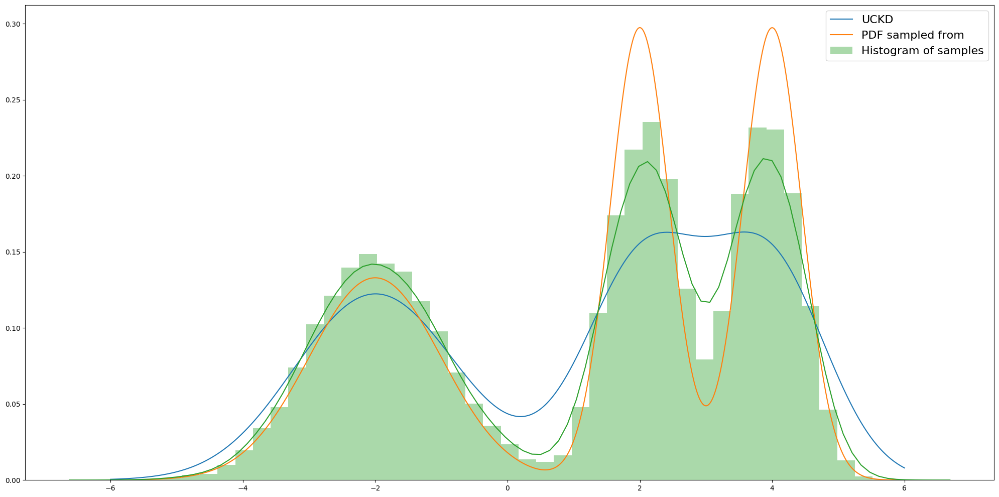

WIP
---

End result is a probability library built in numpy


Documentation
---

- [Inference](#inference)
  - [Posterior](#posterior)
    - [Conjugate priors](#conjugate-priors)
      - [Normal Likelihood](#normal-likelihood)
        - [Normal prior mean](#normal-prior-mean)
        - [Normal prior mean and variance](#normal-prior-mean-and-variance)
        - [Multivariate normal prior mean](#multivariate-normal-prior-mean)
      - [Bernoulli Likelihood](#bernoulli-likelihood)
        - [Beta Prior](#beta-prior)
      - [Categorical Likelihood](#categorical-likelihood)
        - [Dirichlet Prior](#dirichlet-prior)
      - [Exponential Likelihood](#exponential-likelihood)
        - [Gamma Prior](#gamma-prior)
      - [Binomial Likelihood](#binomial-likelihood)
        - [Beta Prior](#beta-prior)
      - [Multinomial Likelihood](#multinomial-likelihood)
        - [Dirichlet Prior](#dirichlet-prior)
- [MCMC](#MCMC)
  - [Metropolis](#metropolis)
  - [Metropolis-Hastings](#metropolis-hastings)
- [Integration](#integration)
  - [Uniform Importance Sampling](#uniform-importance-sampling)
- [Density Estimation](#density-estimation)
  - [Non-parametric UCKD](#uckd)
  - [Non-parametric RCKD](#rckd)
- [Distributions](#distributions)
  - [Normal](#normal)
  - [Multivariate Normal](#multivariate-normal)
  - [Uniform](#uniform)
  - [Multivariate Uniform](#multivariate-uniform)
  - [Bernoulli](#bernoulli)
  - [Categorical](#categorical)
  - [Dirichlet](#dirichlet)
  - [Beta](#beta)
  - [Exponential](#exponential)
  - [Binomial](#binomial)
  - [Multinomial](#multinomial)
  - [Gamma](#gamma)
  - [Normal Inverse Gamma](#normal-inverse-gamma)
  - [Geometric](#geometric)
  - [Poisson](#poisson)
  - [Hypergeometric](#hypergeometric)


# Inference

## Posterior

The posteriors will initially try to use conjugate priors, if they exist, because it is much more efficient. If no prior is implemented it will use numerical methods (or throw an error at the moment)

### Conjugate priors

#### Normal Likelihood

##### Normal prior mean

```python
from probpy.distributions import normal
from probpy.inference import posterior

prior = normal.freeze(mu=1.0, sigma=1.0)
likelihood = normal.freeze(sigma=2.0)

data = normal.sample(mu=-2.0, sigma=2.0, shape=10000)
result = posterior(data, likelihood=likelihood, priors=prior) 
# result is also a r.v with functions sample & p
```

<p align="center">
  
</p>

##### Normal prior mean and variance


```python
from probpy.distributions import normal, normal_inverse_gamma
from probpy.inference import posterior


prior = normal_inverse_gamma.freeze(mu=1.0, lam=2.0, a=3.0, b=3.0)
likelihood = normal.freeze()

data = normal.sample(mu=-2.0, sigma=2.0, shape=100)
result = posterior(data, likelihood=likelihood, priors=prior)
# result is also a r.v with functions sample & p
```

<p align="center">
  
</p>

##### Multivariate normal prior mean

```python
from probpy.distributions import multivariate_normal
from probpy.inference import posterior
import numpy as np

prior = multivariate_normal.freeze(mu=np.ones(2), sigma=np.eye(2))
likelihood = multivariate_normal.freeze(sigma=np.eye(2) * 10)

# make some data 
data_mean = np.ones(2) * -2
data_sigma = np.random.rand(1, 2) * 0.7
data_sigma = data_sigma.T @ data_sigma + np.eye(2) * 1
data = multivariate_normal.sample(mu=data_mean, sigma=data_sigma, shape=200)

result = posterior(data, likelihood=likelihood, priors=prior) 
# result is also a r.v with functions sample & p
```

<p align="center">
  
</p>

#### Bernoulli Likelihood

##### Beta Prior

```python
from probpy.distributions import bernoulli, beta
from probpy.inference import posterior

prior = beta.freeze(a=1.0, b=3.0)
likelihood = bernoulli.freeze()

data = np.array([1.0, 0.0, 1.0, 0.0, 1.0, 1.0, 1.0])
result = posterior(data, likelihood=likelihood, priors=prior)

```

<p align="center">
  
</p>

#### Categorical Likelihood

##### Dirichlet Prior

```python
from probpy.distributions import categorical, dirichlet
from probpy.inference import posterior

prior = dirichlet.freeze(alpha=np.ones(5))
likelihood = categorical.freeze(dim=5)

data = np.array([0, 1, 2, 1, 2, 3, 4, 1])
result = posterior(data, likelihood=likelihood, priors=prior)

prior_samples = prior.sample(shape=10000).sum(axis=0)
posterior_samples = result.sample(shape=10000).sum(axis=0)

```

<p align="center">
  
</p>


#### Exponential Likelihood

##### Gamma Prior

```python
from probpy.distributions import gamma, exponential
from probpy.inference import posterior
prior = gamma.freeze(a=9, b=2)
likelihood = exponential.freeze()

data = exponential.sample(lam=1, shape=100)
result = posterior(data, likelihood=likelihood, priors=prior)

```

<p align="center">
  
</p>

#### Binomial Likelihood

##### Beta Prior

```python
from probpy.distributions import binomial, beta
from probpy.inference import posterior

prior = beta.freeze(a=1.0, b=3.0)
likelihood = binomial.freeze(n=5)

data = np.array([0, 2, 4, 1, 1, 0])
result = posterior(data, likelihood=likelihood, priors=prior)

```

<p align="center">
  
</p>

#### Multinomial Likelihood

##### Dirichlet Prior

```python
from probpy.distributions import multinomial, dirichlet
from probpy.inference import posterior

prior = dirichlet.freeze(alpha=np.ones(3))
likelihood = multinomial.freeze(n=3)

data = np.array([[1, 1, 1], [0, 2, 1], [0, 0, 3], [0, 0, 3]])
result = posterior(data, likelihood=likelihood, priors=prior)

prior_samples = prior.sample(shape=10000).sum(axis=0)
posterior_samples = result.sample(shape=10000).sum(axis=0)

```

<p align="center">
  
</p>


# MCMC

Sampling algorithms

## Metropolis

As long as: p(x) * Z < q(x) * M, this will work, although it might be slow. 

```python3
from probpy.distributions import normal
from progpy.mcmc import metropolis

pdf = lambda x: normal.p(x, 0, 1) + normal.p(x, 6, 3) + normal.p(x, -6, 0.5)
samples = metropolis(size=100000, pdf=pdf, proposal=normal.freeze(mu=0, sigma=10), M=30.0)
```

<p align="center">
  
</p>


## Metropolis-Hastings

```python3
from probpy.distributions import normal
from progpy.mcmc import metropolis_hastings, fast_metropolis_hastings

pdf = lambda x: normal.p(x, 0, 1) + normal.p(x, 6, 3) + normal.p(x, -6, 0.5)
samples = metropolis_hastings(size=50000, pdf=pdf, proposal=normal.freeze(sigma=0.5), initial=-5) # This one takes generic proposal
samples = fast_metropolis_hastings(size=50000, pdf=pdf, initial=-5.0, energy=1.0) # This one is much faster
```

<p align="center">
  
</p>


# Integration

Statistical integration algorithms 

## Uniform Importance Sampling

```python3
from probpy.distributions import normal
from probpy.integration import uniform_importance_sampling

f = lambda x: -np.square(x) + 3
result = uniform_importance_sampling(size=10000, 
                                     function=f, 
                                     domain=(-2, 2), 
                                     proposal=normal.freeze(mu=0, sigma=2))

```
> Wolfram alpha gives 6.66666..

<p align="center">
  
</p>

Multivariate example

```python3
from probpy.distributions import multivariate_normal
from probpy.integration import uniform_importance_sampling

f = lambda x: -np.square(x[:, 0]) + np.square(x[:, 1])

lower_bound = np.array([0, 0])
upper_bound = np.array([4, 2])

results = uniform_importance_sampling(size=100000,
                                      function=f,
                                      domain=(lower_bound, upper_bound),
                                      proposal=multivariate_normal.freeze(mu=np.zeros(2), sigma=np.eye(2) * 2)))
```
> Wolfram alpha gives -32

<p align="center">
  
</p>

# Density Estimation


## UCKD

> Un-normalised Convolution Kernel Density

```python3
from probpy.distributions import normal
from probpy.density import UCKD
from probpy.mcmc import fast_metropolis_hastings

def distribution(x):
    return 0.3333 * normal.p(x, -2, 1) + 0.3333 * normal.p(x, 2, 0.2) + 0.3333 * normal.p(x, 4, 0.2)


samples = fast_metropolis_hastings(50000, distribution, initial=0.0, energy=1.0) # Create some sample to fit

density = UCKD(variance=5.0)
density.fit(samples)

lb, ub = -6, 6
n = 2000

x = np.linspace(lb, ub, n)
y = density.p(x)
y = y / (y.sum() / (n / (ub - lb))) # To make nice plot we renormalize

```

<p align="center">
  
</p>

## RCKD

> Renormalized Convolution Kernel Density (Much slower than UCKD)

```python3
from probpy.distributions import normal
from probpy.density import RCKD
from probpy.mcmc import fast_metropolis_hastings

def distribution(x):
    return 0.3333 * normal.p(x, -2, 1) + 0.3333 * normal.p(x, 2, 0.2) + 0.3333 * normal.p(x, 4, 0.2)


samples = fast_metropolis_hastings(50000, distribution, initial=0.0, energy=1.0) # Create some sample to fit

density = RCKD(variance=5.0, error=1)
density.fit(samples)

lb, ub = -6, 6
n = 2000

x = np.linspace(lb, ub, n)
y = density.p(x) # No need to renormalize here
```

<p align="center">
  
</p>


# Distributions

PDFs / PMFs and sampling functions (the sampling mostly just uses numpy.random.xx)


## Normal

```python3
from probpy.distributions import normal

# Sampling
samples = 10000
mu, sigma = 0, 0.1
n = normal.sample(mu, sigma, samples)


# PDF
x = np.linspace(-4, 4, 100)
n = normal.p(x, mu, sigma)
```

<p align="center">
  
</p>


## Multivariate normal


```python3
from probpy.distributions import multivariate_normal

# Sampling
samples = 10000
mu = np.zeros(2)
mu[0] = 1
sigma = np.eye(2)
sigma[0, 0] = 0.3
sigma[0, 1], sigma[1, 0] = 0.5, 0.5

n = multivariate_normal.sample(mu, sigma, samples)

# PDF
X = ...
P = multivariate_normal.p(X, mu, sigma)
```

<p align="center">
  
</p>

## Uniform

```python3
from probpy.distributions import uniform

#Sampling
samples = 10000
a, b = -2, 3
n = uniform.sample(a, b, samples)

# PDF
x = np.linspace(-4, 4, 100)
n = uniform.p(x, a, b)
```

<p align="center">
  
</p>

## Multivariate uniform

```python3
from probpy.distributions import multivariate_uniform

#Sampling
samples = 10000
a = np.array([-2, -1])
b = np.array([2, 3])
n = multivariate_uniform.sample(a, b, samples)


# PDF
X = ...
P = multivariate_uniform.p(X, a, b)
```

<p align="center">
  
</p>

## Bernoulli

```python3
from probpy.distributions import bernoulli

#Sampling
samples = 10000
p = 0.7
n = bernoulli.sample(p, samples)

# PDF
bernoulli.p(p, 0.0)
```

<p align="center">
  
</p>

## Categorical

```python3
from probpy.distributions import categorical

#Sampling
samples = 10000
p = np.array([0.3, 0.6, 0.1])
n = categorical.sample(p, samples)

# Onehot categories
categorical.one_hot(n, 3)

# PDF
c = 2
categorical.p(c, p)

```

<p align="center">
  
</p>

## Dirichlet

```python3
from probpy.distributions import dirichlet

#Sampling
samples = 10000
alpha = np.array([2.0, 3.0])
n = dirichlet.sample(alpha, samples)


x = ...
p = dirichlet.p(x, alpha)

```

> Note that plot is a projection onto 1D 

<p align="center">
  
</p>

## Beta

```python3
from probpy.distributions import beta

#Sampling
samples = 10000
a, b = np.array(10.0), np.array(30.0)
n = beta.sample(a, b, samples)


x = np.linspace(0.01, 0.99, 100)
y = beta.p(x, a, b)

```

<p align="center">
  
</p>


## Exponential

```python3
from probpy.distributions import exponential

#Sampling
lam = 2
samples = 10000
n = exponential.sample(lam, samples)


# PDF
x = np.linspace(0.0, 5, 100)
y = exponential.p(x, lam)

```

<p align="center">
  
</p>

## Binomial

```python3
from probpy.distributions import binomial

#Sampling
n, p = 20, 0.2
samples = 10000
_n = binomial.sample(n, p, samples)


# PDF
x = np.arange(0, 20)
y = binomial.p(x, n, p)

```

<p align="center">
  
</p>

## Multinomial

```python3
from probpy.distributions import multinomial

#Sampling
n, p = 20, np.array([0.3, 0.5, 0.2])
samples = 10000
_n = multinomial.sample(n, p, samples)

# PDF
x = np.array([[i, j, k] for i in range(n + 1) for j in range(n + 1) for k in range(n + 1) if i + j + k == n])
y = multinomial.p(x, n, p)

```

<p align="center">
  
</p>

## Gamma

```python3
from probpy.distributions import gamma

n = gamma.sample(9, 2, 10000)

x = np.linspace(0, 14, 1000)
true = gamma.p(x, a, b)

```

<p align="center">
  
</p>

## Normal Inverse Gamma

```python3
import numpy as np
from probpy.distributions import normal_inverse_gamma

n = normal_inverse_gamma.sample(2, 1, 2, 2, shape=10000)

points = 100
x = np.linspace(-2, 6, points)
y = np.linspace(0.1, 6, points)

X, Y = np.meshgrid(x, y)
mesh = np.concatenate([X[:, :, None], Y[:, :, None]], axis=2).reshape(-1, 2)

Z = normal_inverse_gamma.p(mesh, mu, lam, a, b).reshape(points, points)

```

<p align="center">
  
</p>

## Geometric


```python3
import numpy as np
from probpy.distributions import geometric

n = geometric.sample(0.7, 10000)

data = np.array([1, 2, 3, 4, 5, 6, 7, 8])
p = geometric.p(data, 0.7)

```

<p align="center">
  
</p>

## Poisson


```python3
import numpy as np
from probpy.distributions import poisson

n = poisson.sample(4, 10000)

data = np.arange(0, 15)
p = poisson.p(x, lam)

```

<p align="center">
  
</p>

## Hypergeometric


```python3
import numpy as np
from probpy.distributions import hypergeometric

n = hypergeometric.sample(N=20, K=13, n=12, shape=samples)

data = np.arange(0, 13)
p = hypergeometric.p(x, N=N, K=K, n=12)

```

<p align="center">
  
</p>

> Sample is just a wrapper for numpy.random.hypergeometric and it seems to struggle with low probability scenarios (fails to sample 2, 3, 4 etc..)

