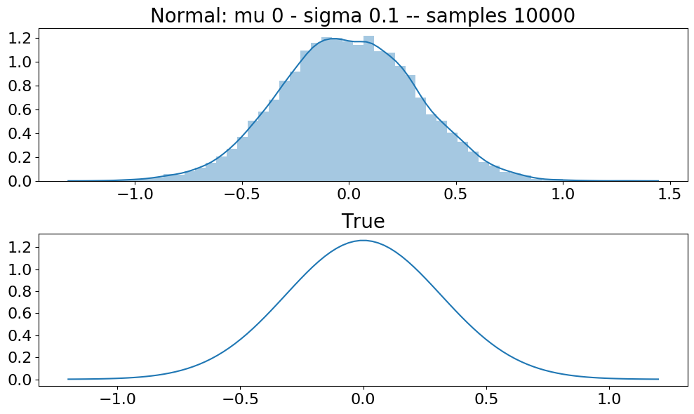
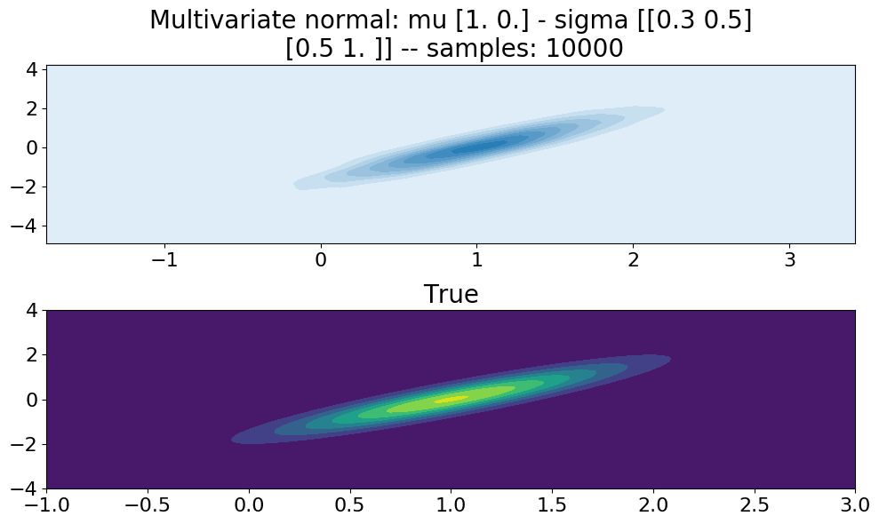

WIP
---

End result is a probability library built in numpy

- [Introduction](#introduction)
- [Documentation](#documentation)

#### Drawbacks
- This library is designed for scalar and vector R.V not higher order R.V, meaning some things might not work for matrix R.V and higher order tensors.

Introduction
---

The fundamental building block is the RandomVariable

Random Variables can be created from any distribution using the "med" function. "med" is Swedish for with. All random variables has a sampling function and a pdf/pmf function.
```python
import probpy as pp

rv = pp.normal.med(mu=0.0, sigma=1.0)

samples = rv.sample(size=5)
density = rv.p(samples)

print(samples)
print(density)
```

```bash
[ 0.56202855 -0.63491592 -1.11501445  0.10756346  1.40117568]
[0.34065788 0.32611746 0.21425955 0.39664108 0.14948112]
```

***Variables can be created with partial arguments***

```python
import probpy as pp
rv = pp.normal.med(sigma=1.0)

print(rv.sample(0.0, size=5))
print(rv.sample(4.0, size=5))
```

```bash
[ 0.24050695  0.19103947  1.01564618 -0.37190388 -0.04080893]
[5.24490748 3.72506806 3.59844073 4.71898881 2.47418571]
```

***Variables can be created from generic functions, for things to work as expected they should be strictly positive***

> Functions need to be using numpy and be vectorised (assume x is a vector or matrix in multivariate case)

```python
import probpy as pp
import numpy as np

m1, m2, m3 = np.ones(2) * 0, np.ones(2) * -3, np.ones(2) * 3
def f(x):
    return np.exp(-((x - m1) * (x - m1)).sum(axis=1)) \
           + np.exp(-((x - m2) * (x - m2)).sum(axis=1)) \
           + np.exp(-((x - m3) * (x - m3)).sum(axis=1))

lower_bound = np.ones(2) * -4
upper_bound = np.ones(2) * 4
rv = pp.function.med(density=f,
                  lower_bound=lower_bound,
                  upper_bound=upper_bound)
```

<p align="center">
  
</p>

***Variables can also be created from a set of points***

```python
import probpy as pp
import numpy as np

diag_mean = np.array([-1, 1])
samples = np.concatenate([
    pp.multivariate_normal.sample(mu=np.ones(2) * -3, sigma=np.eye(2), size=5000),
    pp.multivariate_normal.sample(mu=np.ones(2) * 3, sigma=np.eye(2), size=5000),
    pp.multivariate_normal.sample(mu=np.ones(2) * 0, sigma=np.eye(2), size=5000),
    pp.multivariate_normal.sample(mu=diag_mean * -3, sigma=np.eye(2), size=5000),
    pp.multivariate_normal.sample(mu=diag_mean * 3, sigma=np.eye(2), size=5000),
])

rv = pp.points.med(points=samples)
```

<p align="center">
  
</p>


These variables can be used in many functions in this library. Things ranging from estimating ***parameter posteriors***, ***predictive posteriors***, ***integration*** and ***MCMC*** (and more to come). 

See the documentation below for examples on everything. All the plots in the README was generated by scripts in /test, to reproduce them just visit the test code.


Documentation
---

- [Inference](#inference)
  - [Predictive-Posterior](#predictive-posterior)
    - [Conjugate parameter posteriors](#conjugate-parameter-posteriors)
      - [Bernoulli Likelihood](#bernoulli-likelihood-predictive)
      - [Normal Likelihood](#normal-likelihood-predictive)
      - [Multivariate Normal Likelihood](#multivariate-normal-likelihood-predictive)
    - [Numerically Integrate Posterior](#numerically-integrate-posterior)
- [Learn](#learn)
  - [Parameter Posterior](#parameter-posterior)
    - [Conjugate priors](#conjugate-priors)
      - [Normal Likelihood](#normal-likelihood)
      - [Bernoulli Likelihood](#bernoulli-likelihood)
      - [Categorical Likelihood](#categorical-likelihood)
      - [Exponential Likelihood](#exponential-likelihood)
      - [Binomial Likelihood](#binomial-likelihood)
      - [Multinomial Likelihood](#multinomial-likelihood)
      - [Poisson Likelihood](#poisson-likelihood)
      - [Geometric Likelihood](#geometric-likelihood)
      - [Unilinear Likelihood](#unilinear-likelihood)
    - [MCMC Parameter Estimation](#mcmc-parameter-estimation)
      - [Custom Parameter Likelihood Example](#custom-parameter-likelihood-example)
    - [MCMC + Moment Matching Parameter Estimation](#mcmc--moment-matching-parameter-estimation)
- [MCMC](#MCMC)
  - [Metropolis](#metropolis)
  - [Metropolis-Hastings](#metropolis-hastings)
- [Integration](#integration)
  - [Uniform Importance Sampling](#uniform-importance-sampling)
  - [Expectation of R.V](#expectation-of-rv)
- [Density Estimation](#density-estimation)
  - [Non-parametric UCKD](#uckd)
  - [Non-parametric RCKD](#rckd)
- [Distributions](#distributions)
  - [Normal](#normal)
  - [Multivariate Normal](#multivariate-normal)
  - [Uniform](#uniform)
  - [Multivariate Uniform](#multivariate-uniform)
  - [Bernoulli](#bernoulli)
  - [Categorical](#categorical)
  - [Dirichlet](#dirichlet)
  - [Beta](#beta)
  - [Exponential](#exponential)
  - [Binomial](#binomial)
  - [Multinomial](#multinomial)
  - [Gamma](#gamma)
  - [Normal Inverse Gamma](#normal-inverse-gamma)
  - [Geometric](#geometric)
  - [Poisson](#poisson)
  - [Hypergeometric](#hypergeometric)
  - [Gaussian Process](#gaussian-process)
  - [Unilinear](#unilinear)
  - [Function](#function)
  - [Points](#points)


# Inference

Inference contains functions for predicting future samples

## Predictive Posterior

The "predictive_posterior" function will estimate the predictive posterior given a likelihood and some parameter prior.  Which most likely is some parameter posterior learned with the "parameter_posterior" function. If there exist no conjugate then data can be provided and it will estimate the probability of the data.

The methods the functions uses is
* conjugate priors (this is fast and is what is attempted first)
* Numerical Integration 

### Conjugate parameter posteriors

#### Bernoulli Likelihood predictive

##### Beta Prior

```python
from probpy.distributions import bernoulli, beta
from probpy.inference import predictive_posterior


prior = beta.med(a=8.0, b=3.0)
likelihood = bernoulli.med()

posterior = predictive_posterior(likelihood=likelihood, priors=prior)
# posterior is also a r.v

```

<p align="center">
  
</p>

#### Normal Likelihood predictive

##### Normal Prior

```python
from probpy.distributions import normal
from probpy.inference import predictive_posterior


prior = normal.med(mu=1.0, sigma=1.0)
likelihood = normal.med(sigma=1.0)

posterior = predictive_posterior(likelihood=likelihood, priors=prior)
# posterior is also a r.v
```

<p align="center">
  
</p>


#### Multivariate Normal Likelihood predictive

##### Multivariate Normal Prior

```python
from probpy.distributions import multivariate_normal
from probpy.inference import predictive_posterior
import numpy as np

prior_sigma = np.random.rand(2, 1)
prior_sigma = prior_sigma.T @ prior_sigma + np.eye(2) * 1

likelihood_sigma = np.random.rand(2, 1)
likelihood_sigma = likelihood_sigma.T @ likelihood_sigma + np.eye(2) * 5

prior = multivariate_normal.med(mu=np.zeros(2), sigma=prior_sigma)
likelihood = multivariate_normal.med(sigma=likelihood_sigma)

posterior = predictive_posterior(likelihood=likelihood, priors=prior)
# posterior is also a r.v
```

<p align="center">
  
</p>

## Numerically Integrate Posterior

### Unilinear Example

```python
from probpy.distributions import multivariate_normal, unilinear
from probpy.inference import predictive_posterior
import numpy as np

prior = multivariate_normal.med(mu=np.array([1.0, 0.5]), sigma=np.eye(2) * 1e-1)
likelihood = unilinear.med(sigma=0.3)

x = np.array(0.8)
y = np.linspace(-2, 4, 20)

probability = predictive_posterior(likelihood=likelihood, priors=prior, data=(y, x))
```

<p align="center">
  
</p>

### Odd Custom Example

```python
from probpy.distributions import uniform
from probpy.inference import predictive_posterior
import numpy as np

prior = uniform.med(a=-4, b=4)

def likelihood(y, x, w):
    result = []
    for _w in w:
        result.append(
            normal.p(_w - np.float_power(y, x), mu=0.0, sigma=0.001)
        )

    return np.array(result)

x = np.array(2.0)
y = np.linspace(-3, 3, 20)

probability = predictive_posterior(likelihood=likelihood, priors=prior, data=(y, x), size=10000)

```

<p align="center">
  
</p>

### Custom Logistic Regression Example

```python
from probpy.distributions import multivariate_normal
from probpy.inference import predictive_posterior
import numpy as np


def sigmoid(x):
    return 1 / (1 + np.exp(-x))

def likelihood(y, x, w):
    return normal.p((y - sigmoid(x @ w[:, None, :-1] + w[:, None, None, -1]).squeeze(axis=2)),
                    mu=0.0, sigma=0.01)

x = np.array(0.6).reshape(1, 1)
y = np.linspace(-1, 3, 50)

probability = predictive_posterior(likelihood=likelihood,
                                   priors=multivariate_normal.med(mu=np.array([1.5, 0.1]),
                                                                  sigma=np.eye(2)),
                                   data=(y, x),
                                   size=10000)

```

<p align="center">
  
</p>

# Learn

Learn contains functions for learning parameters of distributions

## Parameter Posterior

The "parameter_posterior" function will estimate the parameter posterior given a likelihood and some priors. 

The methods the functions uses is
* conjugate priors (this is fast and is what is attempted first)
* MCMC 

### Conjugate priors

#### Normal Likelihood

##### Normal prior mean

```python
from probpy.distributions import normal
from probpy.learn import parameter_posterior

prior = normal.med(mu=1.0, sigma=1.0)
likelihood = normal.med(sigma=2.0)

data = normal.sample(mu=-2.0, sigma=2.0, size=10000)
result = parameter_posterior(data, likelihood=likelihood, priors=prior) 
# result is also a r.v with functions sample & p
```

<p align="center">
  
</p>

##### Normal prior mean and variance


```python
from probpy.distributions import normal, normal_inverse_gamma
from probpy.learn import parameter_posterior


prior = normal_inverse_gamma.med(mu=1.0, lam=2.0, a=3.0, b=3.0)
likelihood = normal.med()

data = normal.sample(mu=-2.0, sigma=2.0, size=100)
result = parameter_posterior(data, likelihood=likelihood, priors=prior)
# result is also a r.v with functions sample & p
```

<p align="center">
  
</p>

##### Multivariate normal prior mean

```python
from probpy.distributions import multivariate_normal
from probpy.learn import parameter_posterior
import numpy as np

prior = multivariate_normal.med(mu=np.ones(2), sigma=np.eye(2))
likelihood = multivariate_normal.med(sigma=np.eye(2) * 10)

# make some data 
data_mean = np.ones(2) * -2
data_sigma = np.random.rand(1, 2) * 0.7
data_sigma = data_sigma.T @ data_sigma + np.eye(2) * 1
data = multivariate_normal.sample(mu=data_mean, sigma=data_sigma, size=200)

result = parameter_posterior(data, likelihood=likelihood, priors=prior) 
# result is also a r.v with functions sample & p
```

<p align="center">
  
</p>

#### Bernoulli Likelihood

##### Beta Prior

```python
import numpy as np
from probpy.distributions import bernoulli, beta
from probpy.learn import parameter_posterior

prior = beta.med(a=1.0, b=3.0)
likelihood = bernoulli.med()

data = np.array([1.0, 0.0, 1.0, 0.0, 1.0, 1.0, 1.0])
result = parameter_posterior(data, likelihood=likelihood, priors=prior)

```

<p align="center">
  
</p>

#### Categorical Likelihood

##### Dirichlet Prior

```python
import numpy as np
from probpy.distributions import categorical, dirichlet
from probpy.learn import parameter_posterior

prior = dirichlet.med(alpha=np.ones(5))
likelihood = categorical.med(dim=5)

data = np.array([0, 1, 2, 1, 2, 3, 4, 1])
result = parameter_posterior(data, likelihood=likelihood, priors=prior)

prior_samples = prior.sample(size=10000).sum(axis=0)
posterior_samples = result.sample(size=10000).sum(axis=0)

```

<p align="center">
  
</p>


#### Exponential Likelihood

##### Gamma Prior

```python
from probpy.distributions import gamma, exponential
from probpy.learn import parameter_posterior
prior = gamma.med(a=9, b=2)
likelihood = exponential.med()

data = exponential.sample(lam=1, size=100)
result = parameter_posterior(data, likelihood=likelihood, priors=prior)
```

<p align="center">
  
</p>

#### Binomial Likelihood

##### Beta Prior

```python
import numpy as np
from probpy.distributions import binomial, beta
from probpy.learn import parameter_posterior

prior = beta.med(a=1.0, b=3.0)
likelihood = binomial.med(n=5)

data = np.array([0, 2, 4, 1, 1, 0])
result = parameter_posterior(data, likelihood=likelihood, priors=prior)

```

<p align="center">
  
</p>

#### Multinomial Likelihood

##### Dirichlet Prior

```python
import numpy as np
from probpy.distributions import multinomial, dirichlet
from probpy.learn import parameter_posterior

prior = dirichlet.med(alpha=np.ones(3))
likelihood = multinomial.med(n=3)

data = np.array([[1, 1, 1], [0, 2, 1], [0, 0, 3], [0, 0, 3]])
result = parameter_posterior(data, likelihood=likelihood, priors=prior)

prior_samples = prior.sample(size=10000).sum(axis=0)
posterior_samples = result.sample(size=10000).sum(axis=0)

```

<p align="center">
  
</p>

#### Poisson Likelihood

##### Gamma Prior

```python
from probpy.distributions import gamma, poisson
from probpy.learn import parameter_posterior
prior = gamma.med(a=9, b=2)
likelihood = poisson.med()

data = poisson.sample(lam=2, size=40)
result = parameter_posterior(data, likelihood=likelihood, priors=prior)

```

<p align="center">
  
</p>

#### Geometric Likelihood

##### Beta Prior

```python
import numpy as np
from probpy.distributions import geometric, beta
from probpy.learn import parameter_posterior

prior = beta.med(a=1.0, b=3.0)
likelihood = geometric.med()

data = np.array([0, 2, 4, 1, 1, 0, 8, 8, 9, 8, 10, 10, 10, 10])
result = parameter_posterior(data, likelihood=likelihood, priors=prior)

```

<p align="center">
  
</p>

#### Unilinear Likelihood

##### Multivariate normal parameter prior

```python
import numpy as np
from probpy.distributions import unilinear, multivariate_normal 
from probpy.learn import parameter_posterior

prior = multivariate_normal.med(mu=np.ones(2) * -1, sigma=np.eye(2) * 1e-1)
likelihood = unilinear.med(sigma=1e-1)

variables = np.array([2, 1])
x = np.linspace(-1, 1, 300)
y = unilinear.sample(x=x, variables=variables, sigma=1e-1)
posterior = parameter_posterior((y, x), likelihood=likelihood, priors=prior)

prior_samples = prior.sample(size=10000) # functions for getting mode will come later
posterior_samples = posterior.sample(size=10000)

prior_mean = prior_samples.mean(axis=0)
posterior_mean = posterior_samples.mean(axis=0)

prior_y = unilinear.sample(x=x, variables=prior_mean, sigma=1e-1)
posterior_y = unilinear.sample(x=x, variables=posterior_mean, sigma=1e-1)

```

<p align="center">
  
</p>

### MCMC Parameter Estimation

When there are no conjugate priors the posterior is estimated as a points distribution. ***Note that likelihoods need to be vectorized in both parameters and data here*** not all of the distributions are that yet. 

```python
from probpy.distributions import normal, exponential
from probpy.learn import parameter_posterior

mu_prior = normal.med(mu=3.0, sigma=2.0)
exp_prior = exponential.med(lam=1.0)
likelihood = normal.med()

data = normal.sample(mu=5.0, sigma=2.0, size=300)
#                                                                order matters here
posterior = parameter_posterior(data, likelihood=likelihood, priors=(mu_prior, exp_prior), 
                                size=5000, # Number of points in posterior point distribution,
                                energy=0.05 # The energy in the MCMC distribution - high = more exploration) 
```

<p align="center">
  
</p>

#### Linear Regression Example
```python
from probpy.distributions import multivariate_normal, exponential, unilinear
from probpy.learn import parameter_posterior

prior_variables = multivariate_normal.med(mu=np.zeros(2), sigma=np.eye(2))
prior_noise = exponential.med(lam=1.0)
likelihood = unilinear.med()

x = np.linspace(-2, 2, 60)
variables = np.array([2, 1])
y = unilinear.sample(x=x, variables=variables, sigma=1.0)
posterior = parameter_posterior((y, x),
                                likelihood=likelihood,
                                priors=(prior_variables, prior_noise),
                                size=600,
                                energy=0.05)

print(posterior.sample(size=3000).mean(axis=0))
```

```bash
[1.9861948  0.93879604 1.255713  ]
```

#### Custom Parameter Likelihood Example

This is an example of logistic regression

```python
from probpy.distributions import multivariate_normal
from probpy.learn import parameter_posterior
import matplotlib.pyplot as plt
import numpy as np


def sigmoid(x):
    return 1 / (1 + np.exp(-x))

# This likelihood function broadcasts such that for each w we calculate the probability of (y, x)
# a for loop over w works as well but is significantly slower
def likelihood(y, x, w):
    return normal.p((y - sigmoid(x @ w[:, None, :-1] + w[:, None, None, -1]).squeeze(axis=2)),
                    mu=0.0, sigma=0.5)

x = np.linspace(-5, 5, 50).reshape(-1, 1)
y = (x > 0).astype(np.float).flatten()

posterior = parameter_posterior((y, x),
                                likelihood=likelihood,
                                priors=multivariate_normal.med(mu=np.zeros(2), sigma=np.eye(2)),
                                batch=10,
                                size=10000)

mean = posterior.sample(size=3000).mean(axis=0)

print("accuracy", (y == np.round(sigmoid(x @ mean[:-1] + mean[-1]))).sum() / y.size)

i = np.linspace(-2, 5, 100)
j = np.linspace(-4, 4, 100)
I, J = np.meshgrid(i, j)
K = np.concatenate([I.reshape(-1, 1), J.reshape(-1, 1)], axis=1)
K = posterior.p(K).reshape(100, 100)

plt.figure(figsize=(10, 6))
plt.title("Parameter distribution", fontsize=18)
plt.contourf(I, J, K)
plt.tight_layout()
plt.show()
```
```bash
accuracy 1.0
```

<p align="center">
  
</p>


### MCMC + Moment Matching Parameter Estimation

To avoid those pesky point distributions one can pick a simple distribution and fit it by matching its moments. Why would one want this? Performance reasons.. Also because for normal distributions the mode is the mean which is the mu parameter, this comes in handy at times.

```python
from probpy.distributions import exponential, normal
from probpy.learn import parameter_posterior

prior = exponential.med(lam=0.6)
likelihood = normal.med(sigma=1.0)

data = normal.sample(mu=3.0, sigma=2.0, size=2000)
posterior = parameter_posterior(data,
                                likelihood=likelihood,
                                priors=prior,
                                size=10000,
                                batch=25,
                                match_moments_for=normal)

print(posterior)
```

```bash
Normal -- output: ()
mu: () - 3.0081961422243135
sigma: () - 0.05847424319480537
```

```python
from probpy.distributions import multivariate_uniform, multivariate_normal
from probpy.learn import parameter_posterior

prior = multivariate_uniform.med(a=np.zeros(2), b=np.ones(2) * 4)
likelihood = multivariate_normal.med(sigma=np.eye(2))
data = multivariate_normal.sample(mu=np.ones(2) * 2, sigma=np.eye(2), size=200)

posterior = parameter_posterior(data,
                                likelihood=likelihood,
                                priors=prior,
                                size=10000,
                                batch=25,
                                match_moments_for=multivariate_normal)

print(posterior)

```

```bash
MultiVariateNormal -- output: 2
mu: 2 - [2.00687866 1.97807209]
sigma: (2, 2) - [[0.01759853 0.00079202]
 [0.00079202 0.01714388]]
```


# MCMC

Sampling algorithms

## Metropolis

As long as: p(x) * Z < q(x) * M, this will work, although it might be slow. 

```python3
from probpy.distributions import normal
from progpy.mcmc import metropolis

pdf = lambda x: normal.p(x, 0, 1) + normal.p(x, 6, 3) + normal.p(x, -6, 0.5)
samples = metropolis(size=100000, pdf=pdf, proposal=normal.med(mu=0, sigma=10), M=30.0)
```

<p align="center">
  
</p>


## Metropolis-Hastings

```python3
from probpy.distributions import normal
from progpy.mcmc import metropolis_hastings

pdf = lambda x: normal.p(x, 0, 1) + normal.p(x, 6, 3) + normal.p(x, -6, 0.5)
samples = metropolis_hastings(size=50000, pdf=pdf, proposal=normal.med(sigma=0.5), initial=-5) # This one takes generic proposal
```

<p align="center">
  
</p>

### Fast Metropolis-hastings

There is a fast-mh implementation as well (also a fast-log-space mh implementation that is used internally by other functions). The fast MH is about 100x faster but it does not take a custom proposal distribution.

```python3
from probpy.distributions import normal
from progpy.mcmc import metropolis_hastings, fast_metropolis_hastings
import numpy as np

pdf = lambda x: normal.p(x, 0, 1) + normal.p(x, 6, 3) + normal.p(x, -6, 0.5)

timestamp = time.time()
samples = metropolis_hastings(50000, pdf, normal.med(sigma=1.0), initial=-5)
print(f"MH took {time.time() - timestamp}")

timestamp = time.time()
fast_samples = fast_metropolis_hastings(500000, 
                                        pdf, 
                                        initial=(np.random.rand(1000) - 0.5) * 10.0, 
                                        energy=1.0)

print(f"fast MH took {time.time() - timestamp}")

```

```bash
MH took 1.6391911506652832
fast MH took 0.16809797286987305
```


# Integration

Statistical integration algorithms 

## Uniform Importance Sampling

```python3
from probpy.distributions import normal
from probpy.integration import uniform_importance_sampling

f = lambda x: -np.square(x) + 3
result = uniform_importance_sampling(size=10000, 
                                     function=f, 
                                     domain=(-2, 2), 
                                     proposal=normal.med(mu=0, sigma=2))

```
> Wolfram alpha gives 6.66666..

<p align="center">
  
</p>

Multivariate example

```python3
from probpy.distributions import multivariate_normal
from probpy.integration import uniform_importance_sampling

f = lambda x: -np.square(x[:, 0]) + np.square(x[:, 1])

lower_bound = np.array([0, 0])
upper_bound = np.array([4, 2])

results = uniform_importance_sampling(size=100000,
                                      function=f,
                                      domain=(lower_bound, upper_bound),
                                      proposal=multivariate_normal.med(mu=np.zeros(2), sigma=np.eye(2) * 2)))
```
> Wolfram alpha gives -32

<p align="center">
  
</p>

## Expectation of R.V

Works for any R.V and function, this is what is used internally to compute the probabilities in predictive posterior.

```python
from probpy.distributions import normal
from probpy.integration import expected_value

function = lambda x: x
distribution = normal.med(mu=0, sigma=1)

E = expected_value(100000, function, distribution)
print(E)
```

```bash
0.00394142000271756
```

```python
from probpy.distributions import multivariate_normal
from probpy.integration import expected_value

function = lambda x: x * x
distribution = multivariate_normal.med(mu=np.zeros(2), sigma=np.eye(2))

E = expected_value(1000, function, distribution)
print(E)

```

```bash
[0.99717207 1.0056662 ]
```


# Density Estimation


## UCKD

> Un-normalised Convolution Kernel Density

```python3
from probpy.distributions import normal
from probpy.density import UCKD
from probpy.mcmc import fast_metropolis_hastings

def distribution(x):
    return 0.3333 * normal.p(x, -2, 1) + 0.3333 * normal.p(x, 2, 0.2) + 0.3333 * normal.p(x, 4, 0.2)


samples = fast_metropolis_hastings(50000, distribution, initial=0.0, energy=1.0) # Create some sample to fit

density = UCKD(variance=5.0)
density.fit(samples)

lb, ub = -6, 6
n = 2000

x = np.linspace(lb, ub, n)
y = density.p(x)
y = y / (y.sum() / (n / (ub - lb))) # To make nice plot we renormalize

```

<p align="center">
  
</p>

## RCKD

> Renormalized Convolution Kernel Density (Much slower than UCKD)

```python3
from probpy.distributions import normal
from probpy.density import RCKD
from probpy.mcmc import fast_metropolis_hastings

def distribution(x):
    return 0.3333 * normal.p(x, -2, 1) + 0.3333 * normal.p(x, 2, 0.2) + 0.3333 * normal.p(x, 4, 0.2)


samples = fast_metropolis_hastings(50000, distribution, initial=0.0, energy=1.0) # Create some sample to fit

density = RCKD(variance=5.0, error=1)
density.fit(samples)

lb, ub = -6, 6
n = 2000

x = np.linspace(lb, ub, n)
y = density.p(x) # No need to renormalize here
```

<p align="center">
  
</p>


# Distributions

PDFs / PMFs and sampling functions (the sampling mostly just uses numpy.random.xx)


## Normal

```python3
from probpy.distributions import normal

# Sampling
samples = 10000
mu, sigma = 0, 0.1
n = normal.sample(mu, sigma, samples)


# PDF
x = np.linspace(-4, 4, 100)
n = normal.p(x, mu, sigma)
```

<p align="center">
  
</p>


## Multivariate normal


```python3
from probpy.distributions import multivariate_normal

# Sampling
samples = 10000
mu = np.zeros(2)
mu[0] = 1
sigma = np.eye(2)
sigma[0, 0] = 0.3
sigma[0, 1], sigma[1, 0] = 0.5, 0.5

n = multivariate_normal.sample(mu, sigma, samples)

# PDF
X = ...
P = multivariate_normal.p(X, mu, sigma)
```

<p align="center">
  
</p>

## Uniform

```python3
from probpy.distributions import uniform

#Sampling
samples = 10000
a, b = -2, 3
n = uniform.sample(a, b, samples)

# PDF
x = np.linspace(-4, 4, 100)
n = uniform.p(x, a, b)
```

<p align="center">
  
</p>

## Multivariate uniform

```python3
from probpy.distributions import multivariate_uniform

#Sampling
samples = 10000
a = np.array([-2, -1])
b = np.array([2, 3])
n = multivariate_uniform.sample(a, b, samples)


# PDF
X = ...
P = multivariate_uniform.p(X, a, b)
```

<p align="center">
  
</p>

## Bernoulli

```python3
from probpy.distributions import bernoulli

#Sampling
samples = 10000
p = 0.7
n = bernoulli.sample(p, samples)

# PDF
bernoulli.p(p, 0.0)
```

<p align="center">
  
</p>

## Categorical

```python3
from probpy.distributions import categorical

#Sampling
samples = 10000
p = np.array([0.3, 0.6, 0.1])
n = categorical.sample(p, samples)

# Onehot categories
categorical.one_hot(n, 3)

# PDF
c = 2
categorical.p(c, p)

```

<p align="center">
  
</p>

## Dirichlet

```python3
from probpy.distributions import dirichlet

#Sampling
samples = 10000
alpha = np.array([2.0, 3.0])
n = dirichlet.sample(alpha, samples)


x = ...
p = dirichlet.p(x, alpha)

```

> Note that plot is a projection onto 1D 

<p align="center">
  
</p>

## Beta

```python3
from probpy.distributions import beta

#Sampling
samples = 10000
a, b = np.array(10.0), np.array(30.0)
n = beta.sample(a, b, samples)


x = np.linspace(0.01, 0.99, 100)
y = beta.p(x, a, b)

```

<p align="center">
  
</p>


## Exponential

```python3
from probpy.distributions import exponential

#Sampling
lam = 2
samples = 10000
n = exponential.sample(lam, samples)


# PDF
x = np.linspace(0.0, 5, 100)
y = exponential.p(x, lam)

```

<p align="center">
  
</p>

## Binomial

```python3
from probpy.distributions import binomial

#Sampling
n, p = 20, 0.2
samples = 10000
_n = binomial.sample(n, p, samples)


# PDF
x = np.arange(0, 20)
y = binomial.p(x, n, p)

```

<p align="center">
  
</p>

## Multinomial

```python3
from probpy.distributions import multinomial

#Sampling
n, p = 20, np.array([0.3, 0.5, 0.2])
samples = 10000
_n = multinomial.sample(n, p, samples)

# PDF
x = np.array([[i, j, k] for i in range(n + 1) for j in range(n + 1) for k in range(n + 1) if i + j + k == n])
y = multinomial.p(x, n, p)

```

<p align="center">
  
</p>

## Gamma

```python3
from probpy.distributions import gamma

n = gamma.sample(9, 2, 10000)

x = np.linspace(0, 14, 1000)
true = gamma.p(x, a, b)

```

<p align="center">
  
</p>

## Normal Inverse Gamma

```python3
import numpy as np
from probpy.distributions import normal_inverse_gamma

n = normal_inverse_gamma.sample(2, 1, 2, 2, size=10000)

points = 100
x = np.linspace(-2, 6, points)
y = np.linspace(0.1, 6, points)

X, Y = np.meshgrid(x, y)
mesh = np.concatenate([X[:, :, None], Y[:, :, None]], axis=2).reshape(-1, 2)

Z = normal_inverse_gamma.p(mesh, mu, lam, a, b).reshape(points, points)

```

<p align="center">
  
</p>

## Geometric


```python3
import numpy as np
from probpy.distributions import geometric

n = geometric.sample(0.7, 10000)

data = np.array([1, 2, 3, 4, 5, 6, 7, 8])
p = geometric.p(data, 0.7)

```

<p align="center">
  
</p>

## Poisson


```python3
import numpy as np
from probpy.distributions import poisson

n = poisson.sample(4, 10000)

data = np.arange(0, 15)
p = poisson.p(x, lam)

```

<p align="center">
  
</p>

## Hypergeometric


```python3
import numpy as np
from probpy.distributions import hypergeometric

n = hypergeometric.sample(N=20, K=13, n=12, size=samples)

data = np.arange(0, 13)
p = hypergeometric.p(x, N=N, K=K, n=12)

```

<p align="center">
  
</p>

> Sample is just a wrapper for numpy.random.hypergeometric and it seems to struggle with low probability scenarios (fails to sample 2, 3, 4 etc..)


## Gaussian Process

```python3
import numpy as np
from probpy.distributions import gaussian_process

def mu(x): return 0
def sigma(x, y): return np.exp(-1.0 * np.square(x - y))

X = np.array([0.0, 2.0])
Y = np.random.rand(2)
x = np.linspace(-5, 5, 50)
samples = 10
n = gaussian_process.sample(x=x, mu=mu, sigma=sigma, X=X, Y=Y, size=samples)

probabilities = gaussian_process.p(np.linspace(-2.0, 3.0, 1000), x=np.array([1.0]), mu=mu, sigma=sigma, X=X, Y=Y)

```

<p align="center">
  
</p>

> Calculating probabilities for GP is pretty much impossible when the domain gets large because of precision errors. Beware of using p when x is large 


## Unilinear 

```python3
import numpy as np
from probpy.distributions import unilinear

x = np.linspace(0, 2, 100)
y = unilinear.sample(x=x, variables=np.ones(2), sigma=1e-2, size=100) # final variable is treated as bias
probabilities = unilinear.p(y, x=x, variables=np.ones(2), sigma=1e-2)

```

<p align="center">
  
</p>

## Function

### 1D example

```python3
import numpy as np
from probpy.distributions import function

def f(x): return np.exp(-np.square(x - 1))
rv = function.med(density=f, lower_bound=-5, upper_bound=5, points=10000)

samples = rv.sample(size=s)
x = np.linspace(-1.2, 4, 500)
p = rv.p(x)
```

<p align="center">
  
</p>

### 2D example

```python3
import numpy as np
from probpy.distributions import function

mean = np.ones(2)
def f(x): return np.exp(-((x - mean) * (x - mean)).sum(axis=1))

rv = function.med(density=f, lower_bound=np.ones(2) * -2, upper_bound=np.ones(2) * 2, points=10000)
samples = rv.sample(size=10000)

points = 100
x = np.linspace(-2, 4, points)
y = np.linspace(-2, 4, points)

X, Y = np.meshgrid(x, y)
Z = np.concatenate([X.reshape(-1, 1), Y.reshape(-1, 1)], axis=1)
Z = rv.p(Z)

```

<p align="center">
  
</p>

## Points


```python3
import numpy as np
from probpy.distributions import points, multivariate_normal

samples = np.concatenate([
    multivariate_normal.sample(mu=np.ones(2) * -2, sigma=np.eye(2), size=10000),
    multivariate_normal.sample(mu=np.ones(2) * 2, sigma=np.eye(2), size=10000),
    ])

rv = points.med(points=samples, verbose=True)

s = 10000
samples = rv.sample(size=s)

grid = 100
x = np.linspace(-6, 6, grid)
y = np.linspace(-6, 6, grid)

X, Y = np.meshgrid(x, y)

Z = np.concatenate([X.reshape(-1, 1), Y.reshape(-1, 1)], axis=1)
Z = rv.p(Z)

```

<p align="center">
  
</p>

